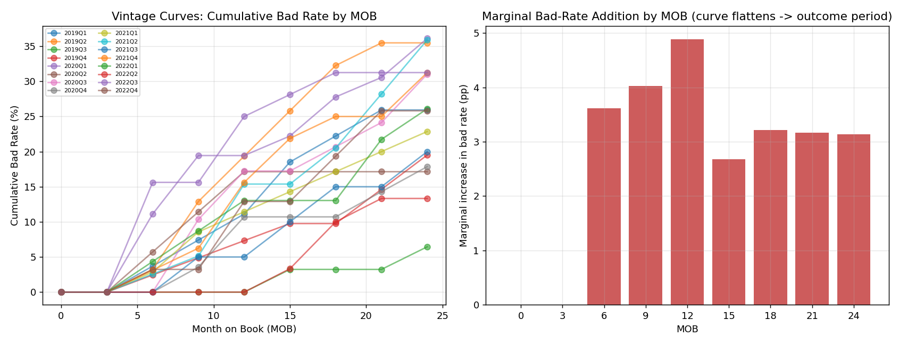
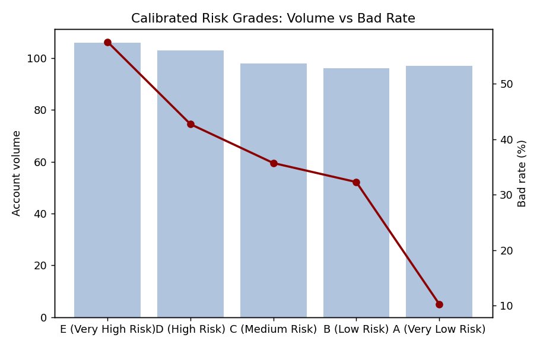
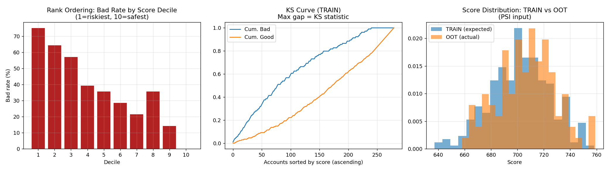

# Credit Risk Early Warning System (EWS)

An end-to-end, industry-style **Credit Risk Early Warning System / PD Scorecard** build, covering every stage a bank's Model Development and Model Validation teams go through — from raw source-system data to a calibrated, validated, regulator-ready scorecard.

> Built on 10 synthetic BFSI data extracts standing in for real systems of record (LOS, Bureau, Core Banking, Collections, Treasury macro feeds). Methodology, thresholds and documentation reflect real scorecard-development practice (IFRS 9 / Basel III / SR 11-7 style governance).

## Pipeline Overview

| # | Stage | Script | Key Output |
|---|-------|--------|-------------|
| 1 | Data Source Identification | `src/s01_data_sources.py` | Data source catalogue, system-of-record mapping |
| 2 | Target Variable Creation | `src/s02_target_vintage_sampling.py` | Vintage curves, outcome-period selection, Train/Test/OOT split |
| 3 | Data Preparation | `src/s03_data_preparation.py` | Missing/outlier treatment, WOE & IV tables |
| 4 | Segmentation | `src/s04_segmentation.py` | Judgemental / statistical (CHAID-proxy) / K-Means comparison |
| 5 | Variable Reduction | `src/s05_variable_reduction.py` | IV, WOE-trend, correlation, VIF, fair-lending filters |
| 6 | Model Creation | `src/s06_model_creation.py` | WOE logistic regression, reject-inference utility |
| 7 | Calibration | `src/s07_calibration.py` | Log-odds → score-points scaling, scorecard, risk grades |
| 8 | Model Validation | `src/s08_model_validation.py` | Gini/AR, KS, Concordance, Rank Ordering, PSI |

Run everything in order with:
```bash
pip install -r requirements.txt
python src/main.py
```
Each stage is also independently runnable, e.g. `python src/s05_variable_reduction.py`.

## Repository Structure
```
ews-credit-risk/
├── data/
│   ├── raw/                     # 10 source extracts (.xlsx)
│   └── processed/                # pipeline intermediate/output datasets
├── src/                          # 8 stage scripts + config.py + main.py
├── outputs/
│   ├── figures/                  # vintage curves, segmentation, KS/PSI charts
│   ├── tables/                   # IV/WOE, reduction log, scorecard, validation metrics
│   └── reports/                  # final technical report (docx)
├── docs/                          # methodology notes
└── requirements.txt
```

## 1. Data Sources
Ten extracts mapped to their real-world system of record (LOS, Core Banking/Finacle, Credit Bureau API, NACH repayment tracker, Collateral Management, Collections, RBI/CMIE macro feed, EDW). See `outputs/tables/01_data_source_catalogue.csv` for row/column counts and null-rate profiling per source.

## 2. Target Variable: Vintage Analysis & Sampling
Cumulative bad-rate vintage curves (by disbursal-quarter cohort, tracked across Month-on-Book) showed the marginal bad-rate addition flattening around **12 MOB**, which was selected as the outcome period. Accounts not yet seasoned to 12 MOB are excluded as indeterminate. A genuine **out-of-time (OOT)** holdout was carved from the most recent disbursal vintage (not randomly sampled) to mimic real validation conditions, alongside a stratified Train/Test split.

| Sample | n | Bad rate |
|---|---|---|
| Train | 280 | 37.1% |
| Test | 120 | 37.5% |
| OOT | 100 | 32.0% |



## 3. Data Preparation
- 2 variables (`Collateral_Value`, `LTV_Ratio`) dropped for >40% missing.
- Remaining missings handled via a dedicated **"Missing" WOE bin** rather than imputation, preserving the information value of missingness — standard scorecard practice.
- Numeric variables Winsorised at the 1st/99th percentile.
- WOE/IV computed on **TRAIN only** (no leakage into Test/OOT), using equal-frequency binning for numerics and direct category WOE for categoricals.

## 4. Segmentation
Three approaches were built and compared (`outputs/figures/04_segmentation_comparison.png`):

- **Judgemental** — by `Loan_Type` (Personal/Home/Auto/Business/Education), bad rates ranging 30.8%–43.8%.
- **Statistical** — a shallow decision tree (CHAID-proxy) found `Bounce_Count_6M` as the dominant splitter, isolating a 100%-bad leaf — flagged as a near-deterministic variable for investigation in Stage 5.
- **Unsupervised** — K-Means (k=2 by silhouette score) on behavioural/financial features separated a 21% bad-rate cluster from a 65% bad-rate cluster.

**Decision:** Judgemental `Loan_Type` segmentation carried forward — most auditable/explainable for regulatory model governance (each product line is contractually its own risk pool).

## 5. Variable Reduction
Full audit trail in `outputs/tables/05_reduction_log.csv`. Order of filters applied:
1. **Business sense / leakage check** — `Bounce_Count_6M` dropped despite IV=5.52 (near-deterministic separator, fails business-sense/noise check).
2. **IV filter** — variables with IV < 0.02 or > 0.5 dropped.
3. **WOE trend check** — non-monotonic numeric WOE trends fixed via adjacent-bin merging (coarse classing) before being judged pass/fail.
4. **Multicollinearity** — pairwise correlation > 0.75 and VIF > 5 filters (`Missed_Payment_Count`, `Savings_Account_Balance` dropped on correlation with retained higher-IV variables).
5. **Fair-lending watchlist** — `Marital_Status`, `Education_Level`, `Age` flagged for compliance sign-off rather than auto-dropped.
6. **Parsimony cap** — final set capped to top 12 by IV.

**Final 12 variables:** `Outstanding_Loans`, `Pay_History`, `Delinquency_12M`, `Interest_Rate_Pct`, `No_of_Inquiries_6M`, `Loan_Type`, `Total_Current_Balance`, `Transaction_Count_3M`, `Credit_Utilization_Ratio`, `Marital_Status`, `Education_Level`, `Employment_Years`.

## 6. Model Creation
- WOE-transformed final variables fed into a **logistic regression** (industry default for an interpretable, regulator-defensible PD model).
- **Benefit of WOE** documented in-code: puts numeric & categorical variables on one comparable log-odds scale, captures non-linearity without splines, handles missingness as signal, and converts cleanly to scorecard points.
- **Reject inference** is documented with a ready-to-use parcelling utility (`reject_inference_parcelling()`), but not executed — this dataset contains only booked/approved accounts, so no reject population exists yet.

## 7. Calibration
Log-odds scaled to score points using the standard `Offset + Factor × ln(odds)` formulation (base score 600, PDO 20). Score-points are computed **per individual WOE attribute** (`outputs/tables/07_scorecard_points.csv`) — the artefact a credit committee actually signs off on.

Quantile-based risk grades show clean rank ordering by bad rate:

| Grade | n | Bad rate | Avg score |
|---|---|---|---|
| E (Very High Risk) | 106 | 57.5% | 671.8 |
| D (High Risk) | 103 | 42.7% | 692.8 |
| C (Medium Risk) | 98 | 35.7% | 705.0 |
| B (Low Risk) | 96 | 32.3% | 716.1 |
| A (Very Low Risk) | 97 | 10.3% | 734.8 |



## 8. Model Validation

| Sample | n | Gini (AR) | KS % | Concordant % | C-stat (AUC) |
|---|---|---|---|---|---|
| Train | 280 | 0.508 | 38.6 | 74.7 | 0.754 |
| Test | 120 | 0.256 | 25.3 | 62.6 | 0.628 |
| OOT | 100 | 0.250 | 28.9 | 61.7 | 0.625 |

- **Rank ordering**: near-monotonic bad-rate decline from riskiest to safest decile (one minor decile-8 inversion flagged for investigation — a realistic validator finding, not smoothed away).
- **PSI** (Train expected vs OOT actual) = **0.077** → stable, no significant population drift.



**Honest takeaway:** Train Gini (0.51) materially exceeds Test/OOT Gini (~0.25), indicating some overfitting on this small (500-record) sample — exactly the kind of gap a Model Validation team would flag and require a larger/more recent dataset or simpler variable set to close before production sign-off. This gap is preserved deliberately rather than hidden, since recognising and reporting it is itself part of a correct EWS validation exercise.

## Tech Stack
Python · pandas · scikit-learn · statsmodels · matplotlib

## License
MIT — see [LICENSE](LICENSE).
